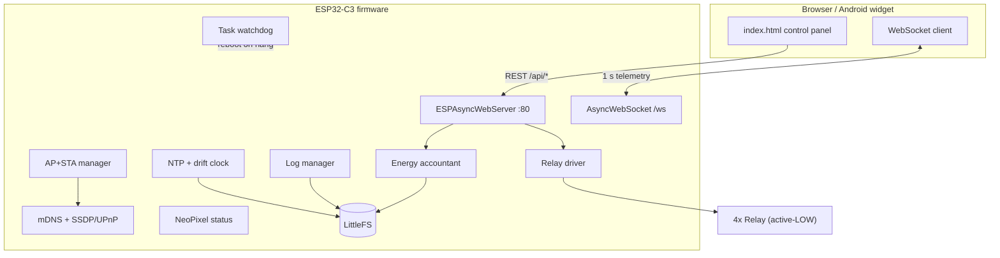
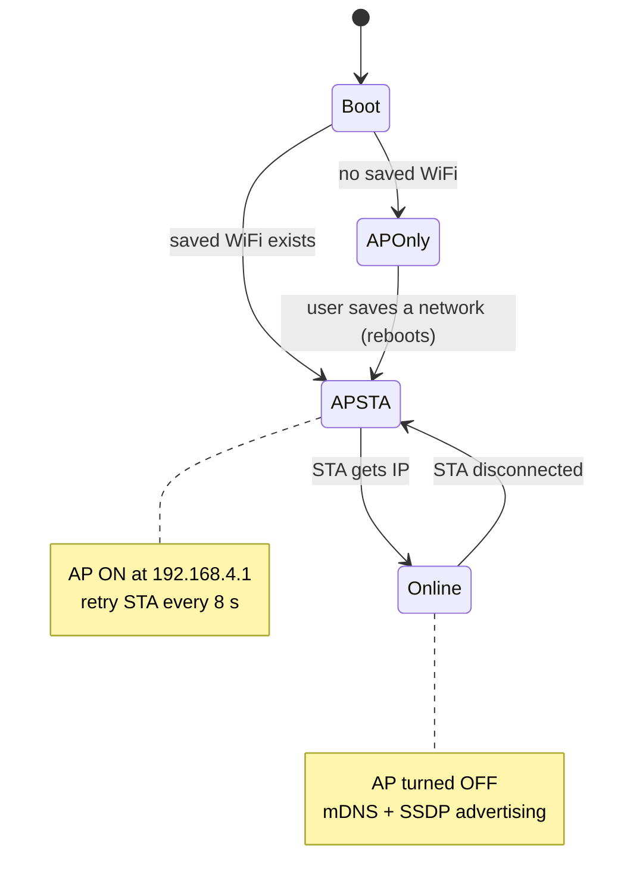
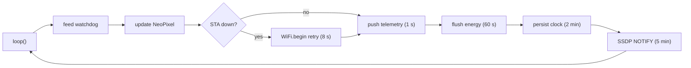

# LEO Smart Switch — ESP32-C3 (Phase 1)

## What's new (v1.4.2 — full-codebase bug audit)
- **Fixed real cross-task race conditions.** HTTP/WS handlers run on the
  AsyncTCP task while `loop()` runs on the main Arduino task - several
  shared globals were read/written from both with no protection: the peer
  table (`peers[]`), the energy history (`energyDays[]`), and the WiFi
  credentials (`cfg.staSsid`/`cfg.staPass`, an Arduino `String` - a
  concurrent reassignment there is a use-after-free of its old buffer, not
  just a stale value). Added a real FreeRTOS mutex (safe to hold across
  String work, unlike a spinlock) with an RAII guard so a lock can't be
  left held on an early return, and applied it to all of these. This is
  scoped to the highest-severity fields, not every `cfg` field - a full
  rewrite of every shared String to a lock-free design is a larger change
  than is safe to make without a compiler to verify it.
- **Fixed: log pruning never actually ran.** `logPrune()` was called exactly
  once, at boot, *before* the clock syncs - so its age-based 90-day cutoff
  was always a no-op, and it never ran again afterward. Now also runs
  periodically from `loop()`.
- **Peer table: evict oldest instead of dropping newest.** Once `MAX_PEERS`
  is reached, a newly-discovered device now replaces the least-recently-seen
  entry instead of being silently ignored forever.
- **Web UI: fixed a Console reconnect-loop bug.** `connectConsole()` closed
  the previous socket without clearing its `onclose` handler first: since a
  deliberate `.close()` still fires `onclose`, every reconnect (including
  automatic ones) could spawn an extra stacking reconnect timer.

## What's new (v1.4.1 — fix a responsiveness regression from v1.4.0)
- **Fixed: relay toggles, the dashboard, and WiFi all got sluggish after the
  live console shipped.** `dbg()` (called on every relay toggle, WiFi retry,
  and peer-discovery event) wrote to `Serial` unconditionally. On this board's
  USB-CDC serial, `Serial.println()` **blocks** once the TX buffer fills if no
  USB host is actually attached and reading — the normal case once you unplug
  the programming cable. Every one of those events now stalled until the
  device rebooted or a cable was reattached. `dbg()` now guards with
  `if (Serial)` (the documented fix for exactly this HWCDC behavior on
  ESP32-C3) so it never blocks when running untethered.
- **Removed a second, slower-burning cause.** The console's 200-line ring
  buffer stored Arduino `String` objects reassigned forever as it wrapped —
  a known source of heap fragmentation on ESP32 over long uptime, which would
  make things gradually worse the longer the device ran. It's now fixed-size
  `char` buffers with no repeated heap churn.

## What's new (v1.4.0 — live serial console)
- **Live console, wired everywhere.** The firmware now mirrors every meaningful
  debug line (WiFi connect/retry/disconnect, mDNS ownership, relay toggles,
  peer discovery, boot/error events) to USB serial **and** to a new `/console`
  WebSocket — a 200-line RAM ring buffer means a client that connects mid-stream
  still gets recent history, not just what happens after it joins.
  - **Web UI:** System → **Console** tab, a live-scrolling terminal.
  - **Android app:** device detail → **Live console** screen.
  - High-frequency debug lines are RAM-only by design (persisting them to flash
    on every relay flip or peer beacon would wear it out); the existing
    disk-persisted CRIT/ERR log in System → Logs is unchanged.

## What's new (v1.3.1 — WiFi reconnect fix + security hardening)
- **Fixed: device stuck on AP mode forever after a failed boot-time WiFi join.** The retry loop called `WiFi.begin()` repeatedly without an intervening `WiFi.disconnect()`; the IDF driver silently ignores a bare repeat `begin()` after a failed/absent-AP attempt, so the unit never actually retried even once the router was broadcasting again. Every retry now disconnects first.
- **Stronger password storage:** login password is now salted **SHA-256** (mbedtls, salt = the device's own stable ID) instead of an unsalted 32-bit FNV1a hash. Passwords set on older firmware will need to be re-entered once (a log entry / Security tab flags this).
- **CSRF / DNS-rebinding guard:** all control endpoints now reject requests whose browser `Origin` isn't a private LAN address or `*.local` host, so an arbitrary public webpage can no longer flip relays on a device that has login disabled (the wildcard CORS needed for the peer dashboard is otherwise unrestricted).
- **Login lockout:** 5 consecutive failed `/api/login` attempts trigger a 30 s lockout to slow brute forcing.
- **Default AP password nudge:** a warning is logged at boot and shown on the Network tab if the AP password hasn't been changed from the firmware default.

A **local-first, 4-channel smart relay controller** for the ESP32-C3. It hosts its
own web UI, joins your home WiFi with automatic Access-Point failover, keeps time
even when the internet is down, estimates per-relay energy use, recovers itself
from hangs, and advertises itself as a discoverable smart-home device on your LAN
— all **without any cloud, account, or voice ecosystem**.

> Phase 1 = firmware + web UI + on-network discovery.
> Phase 3 = native Android home-screen widget (auto-discovers this device).
> Voice assistants (Google/Alexa) are intentionally out of scope.


## What's new (v1.3 — LED control, leoswitch ownership, resilience)
- **Status-LED controls** in System → LED: **Off**, **Auto-off** (lights on changes, then sleeps once steady-online so it stops drawing power), or **Always**; plus a **brightness** slider, an **auto-off delay**, and an **Identify** blink to find a specific box.
- **`leoswitch.local` is now always reachable** via ownership election: the **master** owns it; if no master is present the **lowest-ID online** unit takes it; the rest use `leo-<id>.local`. If the owner drops, another claims it automatically (~20 s). Type `auto` in the mDNS field to rejoin the election, or set a fixed name to pin a unit.
- **Robustness:** mDNS/beacon re-advertise is deferred out of async-handler context (prevents a class of crashes), `LittleFS` mount and `MDNS.begin` now retry, the WiFi long-down reset timer no longer mis-fires, and the dashboard wraps API calls in retry/guard helpers so a transient hiccup doesn't blank a tab.

## What's new (v1.2 — reliable connectivity)
- **Discovery rebuilt on `WiFiUDP`** (was `AsyncUDP`, which failed to broadcast after the AP→STA switch) — devices now actually find each other. Beacon broadcasts to the subnet-directed *and* global broadcast address.
- **Manual "add by IP"** on the Devices tab as a fallback when a router blocks broadcasts.
- **WiFi resilience:** keeps retrying STA every ~8 s while the AP stays up, `setAutoReconnect` on, a **health check** that detects a "connected-but-stuck" link (no IP / RSSI flatline) and forces a reconnect, and a 2-minute hard radio reset for deep wedges.
- **AP name = Device ID.** Both now share the same `XXXXXX` tag and the Network tab shows an identity summary, so the AP you connect to clearly matches the device.
- API is **app-ready**: stable `/api/identity`, `/api/peers`, `/api/state`, control + `/api/login`, all CORS-enabled, identity keyed on the MAC-derived `LEO-XXXXXX`.

## What's new (v1.1 — cluster & navigation)
- **Stable per-device ID** (`LEO-XXXXXX`) and a **UDP LAN beacon** so devices detect each other independently of mDNS.
- **Unified dashboard:** open any one switch and see/control every switch on the network (CORS-enabled API).
- **Master / Slave / None roles** broadcast to the whole group.
- **Configurable mDNS hostname** (recovery address) — changeable live in Network settings.
- **New footer-tab navigation** (Home · Devices · Energy · Network · System) with a logo→Home shortcut and an unsaved-changes guard.

---

## 1. Design philosophy

| Principle | What it means here |
|-----------|--------------------|
| **Local-first** | Everything works on the device; no server, no internet dependency for control. |
| **Lightweight** | Single async web server + 1 Hz WebSocket push; no heavy frameworks; UI has zero external CDNs so it loads in offline AP mode. |
| **Always reachable** | If WiFi is present it joins it; if not (or it drops), it instantly falls back to its own AP. |
| **Fail-safe relays** | Relay state is never saved. After any reboot or power cut, all relays come up **OFF** — no surprise loads after a long outage. |
| **Self-recovering** | A task watchdog reboots the device if the main loop ever stalls. |
| **Flash-friendly** | Live data is RAM-only and pushed every second; persistence happens on a slow cadence to protect flash endurance. |

---

## 2. Feature summary

| Area | Capability |
|------|------------|
| Relays | 4 channels, **active-LOW**, glitch-safe OFF at boot, live on/off + all-on/all-off |
| Connectivity | AP+STA with automatic failover; mDNS `leoswitch.local`; router hostname `LEO-XXXXXX` (unique) |
| Web UI | Header (logo, status, settings), live 12/24h clock, expandable telemetry bar, relay cards, 5-section settings drawer |
| Clock | NTP with offline fallback + drift correction; seeds from last-known time |
| Energy | Estimated Wh/kWh per relay (wattage × on-time), 30-day line graph, ₹ cost |
| Discovery | Rich mDNS TXT records + dedicated `_leoswitch._tcp` service + SSDP/UPnP responder |
| Status LED | Single WS2812 reflects AP / connecting / online / fault |
| Logs | Critical + error only; auto-prune by age (90 days) and storage (>80%) |
| Security | Optional login; remembers known browsers via token (no re-prompt) |
| Recovery | Hardware task watchdog; soft reboot; factory reset |

---

## 3. Hardware

### 3.1 Wiring

| Function | GPIO | Type | Notes |
|----------|------|------|-------|
| Relay 1 | 0 | Output (active-LOW) | Driven OFF before output enable → no boot trigger |
| Relay 2 | 1 | Output (active-LOW) | |
| Relay 3 | 3 | Output (active-LOW) | |
| Relay 4 | 10 | Output (active-LOW) | |
| Status LED | 2 | WS2812 data (1 px) | 3.3 V data — keep lead short or add a level shifter |
| Power | 3V3 / GND | — | Relay coil side typically needs separate 5 V; isolate per your board |

> **Active-LOW** means a GPIO LOW energizes the relay. The firmware writes the OFF
> level *before* switching the pin to output, so mechanical relays (≈5–10 ms
> pull-in) ignore the microsecond boot window and stay off.

### 3.2 Status LED meaning

| Colour | State |
|--------|-------|
| Pulsing **blue** | AP only (no WiFi joined yet) |
| Pulsing **amber** | Connecting / reconnecting to WiFi |
| Solid dim **green** | Online (joined your WiFi) |
| **Red** | Fault (e.g. filesystem init failed) |

---

## 4. Architecture



### 4.1 Connectivity state machine



### 4.2 Main loop / data flow



---

## 5. Web UI layout

Navigation is a **persistent footer tab bar** — no more digging through a settings
drawer. Tapping the **logo or title** jumps straight to Home; if you were editing
settings, an **unsaved-changes guard** asks to *Continue setup* or *Discard* first
(so an accidental touch never loses your input).

```
┌───────────────────────────────────────────────┐
│ [logo]  Living Room Switch   [WIFI ●] [MASTER] │   header (tap → Home)
│         9:42:18 PM                192.168.1.154 │   live clock + IP  (Home)
├───────────────────────────────────────────────┤
│ telemetry bar ▾   ·   All On / All Off          │
│ Relay 1  GPIO0  On 1h23m  ≈60W            [⏻]   │
└───────────────────────────────────────────────┘
┌──── footer tabs (always visible) ──────────────┐
│  Home    Devices    Energy    Network   System  │
└─────────────────────────────────────────────────┘
```

| Tab | Contents |
|-----|----------|
| **Home** | This device: live clock, telemetry bar, All On/Off, relay toggles |
| **Devices** | Every LEO switch on the LAN (live), per-device toggles + All On/Off, Master/Slave/None role for this unit, "Open" to jump to a peer |
| **Energy** | 30-day kWh graph, 30-day kWh + ₹ totals, editable tariff |
| **Network** | Device name, **mDNS hostname change**, WiFi scan/join, AP name/password |
| **System** | Sub-tabs: Time/NTP · Relay GPIO map · Security (login) · Logs · Device (ID, model, reboot, factory reset) |

---

## 6. Identity, detection & clustering (local, no cloud)

Every unit has a **stable device ID** derived from its MAC — `LEO-XXXXXX` — that
**never changes** and is what the system uses to detect and tell devices apart.
mDNS is only a convenience address and is fully user-changeable; it is *not* used
for detection, so a hostname clash can never hide a device.

| Mechanism | Purpose |
|-----------|---------|
| **Stable ID (`LEO-XXXXXX`)** | The real identity. Carried in the LAN beacon, mDNS TXT, and `/api/state`. |
| **LAN beacon (UDP :49497)** | Each unit broadcasts `{id,name,ip,role,group,type}` every 5 s and listens for others, building a live peer table. **This is how devices find each other — independent of mDNS.** |
| **mDNS / Bonjour** | Per-device host (default `leoswitch.local`), **changeable** in Network settings. Advertises `_leoswitch._tcp` with TXT `id`, `name`, `role`, `group`, `type`. |
| **SSDP / UPnP** | Best-effort listing in generic network/UPnP browsers (`/description.xml`). |
| **CORS on the API** | Lets any device's dashboard read and control its peers directly, so **opening one device shows and controls them all**. |

### Cluster & roles
- Only units of `type=smartswitch` join the cluster — a dedicated **Devices** page
  lists exactly the switches on your network and nothing else.
- Each device can be set **Master**, **Slave**, or **None** (`/api/role`). The role
  is broadcast in the beacon and shown on every dashboard, so every unit knows who
  is in charge. (For now the role is an explicit label/coordination marker; the
  dashboard works peer-to-peer regardless of which unit you open.)
- The **Devices** page aggregates every peer's live state and lets you toggle any
  relay or all-on/all-off on any unit, or jump to that unit's own page.

> Beacon detection works on both your router's subnet and the device's own AP
> subnet. If a peer has login enabled, cross-device control of it needs that
> device's token; otherwise peers are controlled directly over the LAN.

---

## 7. Project structure

```
LEO_SmartSwitch/
├── README.md                ← this file
├── platformio.ini           ← PlatformIO build (optional alternative to Arduino IDE)
├── LEO_SmartSwitch.ino       ← firmware (C++)
├── config.h                 ← pins, defaults, tuning constants
└── data/
    └── index.html           ← web UI, flashed to LittleFS
```

> The folder name **must** match the `.ino` name for the Arduino IDE.
> `data/` is the LittleFS image (the web UI), flashed separately from the sketch.

---

## 8. Build & flash

### 8.1 PlatformIO (recommended — handles libraries for you)

Uses the maintained `ESP32Async/ESPAsyncWebServer` + `ESP32Async/AsyncTCP` (see `platformio.ini`).

| Step | Command |
|------|---------|
| Build | `pio run` |
| Flash firmware | `pio run -t upload` |
| Flash web UI (LittleFS) | `pio run -t uploadfs` |
| Serial monitor | `pio device monitor` |

`platformio.ini` already pins the board, LittleFS filesystem, and libraries.

### 8.2 Arduino IDE 2.x

1. **Boards:** install *esp32 by Espressif* (core **3.x**) via Boards Manager.
2. **Libraries** (Library Manager):
   - *ESPAsyncWebServer* by **ESP32Async** (+ its *AsyncTCP* by ESP32Async)
   - *ArduinoJson* (**v7**)
   - *Adafruit NeoPixel*
   > Use the **ESP32Async** versions. The old me-no-dev / mathieucarbou packages are archived; installing the wrong fork is the #1 reason the build fails.
3. **LittleFS uploader:** install the *arduino-littlefs-upload* plugin.
4. **Board settings:**

   | Setting | Value |
   |---------|-------|
   | Board | ESP32C3 Dev Module |
   | Partition Scheme | any scheme **with a filesystem** (e.g. Default 4MB with spiffs) |
   | USB CDC On Boot | Enabled |
   | Upload speed | 921600 (lower if it fails) |

5. **Upload sketch:** the normal Upload button.
6. **Upload web UI:** `Ctrl/Cmd + Shift + P` → *Upload LittleFS to Pico/ESP8266/ESP32*.

---

## 9. First-time setup

1. Power on. With no saved WiFi the LED pulses **blue** and the device hosts AP
   **`LEO-SmartSwitch`** (password `leo12345`).
2. Connect to that AP and open **`http://192.168.4.1`**.
3. **Settings → Network → Scan**, pick your router, enter the password, **Save & reconnect**.
4. The device reboots, keeps its AP up, joins your WiFi in the background, then drops
   the AP the instant it's online (LED turns **green**).
5. Your router lists it as **`ESP32-c3-smartswitch`**; afterwards reach it at
   **`http://leoswitch.local`**.

---

## 10. JSON API

Discovery: mDNS `_leoswitch._tcp` (or `leoswitch.local`). When login is enabled,
send the `X-Auth-Token` header obtained from `/api/login`.

| Method | Path | Body | Auth | Purpose |
|--------|------|------|:----:|---------|
| GET  | `/api/state` | — | open | Full telemetry incl. `id`, `role`, `total_watts` (also pushed on `ws://…/ws` every 1 s) |
| GET  | `/api/identity` | — | open | This unit's stable `id`, `name`, `role`, `group`, `mdns`, `ip` |
| GET  | `/api/peers` | — | open | All LEO switches on the LAN (self first) from the beacon table |
| POST | `/api/role` | `{role,group}` | ✓ | Set Master / Slave / None |
| POST | `/api/devicename` | `{name}` | ✓ | Set friendly device name |
| POST | `/api/mdns` | `{mdns}` | ✓ | Change mDNS hostname (applied live, no reboot) |
| POST | `/api/relay` | `{i,on}` | ✓ | Toggle one relay |
| POST | `/api/all` | `{on}` | ✓ | All relays on/off |
| GET  | `/api/energy` | — | open | 30-day kWh + cost series |
| POST | `/api/tariff` | `{tariff}` | ✓ | Set ₹/kWh |
| GET  | `/api/scan` | — | ✓ | WiFi scan (`202` while scanning) |
| POST | `/api/network` | `{ssid,pass}` | ✓ | Join WiFi (reboots) |
| POST | `/api/ap` | `{ssid,pass}` | ✓ | Change AP (reboots) |
| GET/POST | `/api/timecfg` · `/api/time` | `{tz,h24}` | ✓ | Read / set clock options |
| GET | `/api/relaymap` | — | open | GPIO pool + current mapping |
| POST | `/api/relaymap/set` | `{relays:[{name,gpio,watts}]}` | ✓ | Remap (unique GPIO enforced) |
| GET/POST | `/api/authcfg` · `/api/auth` | `{enabled,user,pass}` | ✓ | Security settings |
| POST | `/api/login` | `{user,pass}` → `{token}` | open | Obtain a remembered token |
| GET/POST | `/api/logs` · `/api/logs/clear` | — | ✓ | View / clear persisted CRIT/ERR logs |
| WS | `ws://…/console` | — | open | Live serial mirror: every debug line, replayed from a 200-line RAM buffer on connect, then streamed live |
| POST | `/api/reboot` | — | ✓ | Soft reboot |
| POST | `/api/reset` | `{confirm:"RESET"}` | ✓ | Factory reset |
| GET | `/description.xml` | — | open | UPnP device description (SSDP) |

---

## 11. Tunable constants (`config.h`)

| Constant | Default | Meaning |
|----------|---------|---------|
| `RELAY_GPIO_POOL` | `{0,1,3,10}` | The four relay pins |
| `NEOPIXEL_PIN` | `2` | WS2812 data pin |
| `WIFI_TX_POWER` | `8.5 dBm` | Low TX power for C3 RF stability |
| `TICK_PUSH_MS` | `1000` | Telemetry push cadence |
| `ENERGY_FLUSH_MS` | `60000` | Energy persistence interval |
| `STA_RETRY_MS` | `8000` | WiFi reconnect retry |
| `WDT_TIMEOUT_S` | `10` | Watchdog reboot threshold |
| `DEFAULT_TZ` | `IST-5:30` | Timezone (India, no DST) |
| `LOG_MAX_AGE_DAYS` | `90` | Log retention (~3 months) |
| `ENERGY_DAYS` | `31` | Energy graph window |
| `DEFAULT_TARIFF` | `6.50` | ₹/kWh |

---

## 12. Behaviour guarantees

| Event | Result |
|-------|--------|
| Power loss / reboot | All relays come up **OFF** (state is never saved) |
| WiFi drops | AP comes back instantly; keeps retrying STA in the background |
| Loop hang | Watchdog reboots → relays OFF (acceptable by design) |
| No internet | Clock runs from last-known time; corrects drift when NTP returns |
| Sudden cut | At most ~60 s of energy accounting lost (flush cadence) |
| Storage > 80% or log > 90 days | Oldest log entries pruned automatically |

---

## 13. Troubleshooting

| Symptom | Likely cause / fix |
|---------|--------------------|
| Compile error in ESPAsyncWebServer | Using the old me-no-dev fork — switch to **mathieucarbou** |
| Web UI is blank / 404 at `/` | LittleFS image not flashed — run the *Upload LittleFS* / `uploadfs` step |
| `leoswitch.local` won't resolve | Use the IP shown on the clock row; some networks block mDNS |
| Relays click ON at boot | Confirm the board is **active-LOW**; check `RELAY_ACTIVE_LOW` in `config.h` |
| WiFi unstable on C3 | Keep `WIFI_TX_POWER` low; check antenna/USB power quality |
| Not visible in UPnP browser | Normal on some networks — use mDNS / the app instead |
| Clock shows `~` after time | NTP not yet reached; it's running on the internal clock |
| Booted to AP, won't join WiFi | It retries every ~8 s automatically; check the saved SSID/password in Network. After 2 min of failure it hard-resets the radio. |
| Shows "connected" but unresponsive | The health check forces a reconnect within ~30 s; this is automatic now. |
| Two devices don't see each other | Flash this v1.2 (WiFiUDP beacon). If still missing, the router likely blocks client broadcasts — use **Devices → Add by IP**. |
| AP name vs device name confusion | The AP defaults to the Device ID (`LEO-XXXXXX`); the Network tab shows the identity summary tying them together. |
| Device runs hot | See **Thermal** below — usually WiFi modem sleep, CPU clock, the relay supply, or inverted relay polarity holding coils on |

---

## 14. Roadmap

- **Phase 3 — Android app:** native Kotlin with a Jetpack Glance home-screen widget
  (4 toggles + all-on/all-off), auto-discovery via Android NSD (`_leoswitch._tcp`),
  consuming the JSON API above.

---


## 14a. Thermal — why it might run hot (and what's fixed)

The C3's **internal temperature sensor reads the die, not the room**, and normally
sits 20–40 °C above ambient — so a reading of 45–60 °C and a board that's warm to
the touch is expected. "Hot" beyond that usually comes from:

**Firmware (now tuned for low heat):**
- **WiFi modem sleep** is now **enabled** (`WiFi.setSleep(true)`) — the radio no
  longer stays fully powered 100% of the time. Biggest single reduction. (If your
  WiFi gets flaky on a particular C3 clone, set it back to `false` — that's the
  heat/stability trade-off.)
- **CPU drops to 80 MHz** (`CPU_MHZ` in `config.h`) — about half the dynamic power
  of 160 MHz, and still plenty for the web server. Raise to 160 if you want it.
- TX power is already held low for the C3 (`WIFI_TX_POWER`).

**Hardware (check these — firmware can't fix them):**
- **Relay polarity.** If your board is actually **active-HIGH** but `RELAY_ACTIVE_LOW`
  is `1`, the firmware drives the "off" level that energizes all four coils — they'll
  sit on permanently and cook the relay board and supply. Quick test: if the UI shows
  every relay OFF but the relays are physically clicked ON, flip `RELAY_ACTIVE_LOW`.
- **Powering relays/LEDs from the C3 board.** Relay coils draw ~60–80 mA each; four of
  them through the board's tiny LDO/USB path will overheat the regulator. Power the
  relay board's coil supply (JD-VCC) from its own 5 V, sharing only ground.
- **Input voltage.** Feeding 5 V into the board's 5 V pin makes the on-board LDO drop
  5→3.3 V and dissipate heat under WiFi current peaks; feeding higher than 5 V is
  worse. Use clean 5 V (or USB) and don't load the 3V3 rail.

## 15. Caveats

- This is a complete first pass written without on-board compilation; expect minor
  library/version tweaks and some board-side debugging.
- The SSDP reply path (`AsyncUDPPacket::printf`) and the watchdog config struct are
  the two spots most likely to need adjusting for your exact core version.
- Estimated energy is **not** metered — it is `wattage × on-time` from the values you
  enter per relay.
